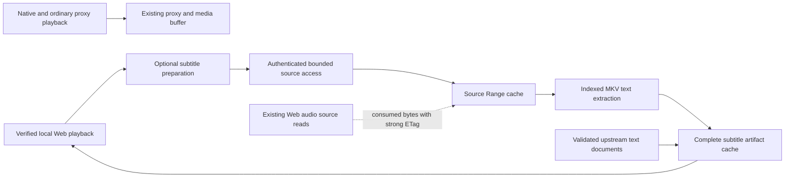

# Shared source access and subtitle recovery

Status: conservative first version implemented, 2026-09-12. The user approved
the broader direction and then explicitly prioritized preserving existing
playback over recovering every Web subtitle. [ADR 0005](../adr/0005-web-subtitles.md)
is the implemented contract. Future directions below are not implemented
features, configuration switches, or a production deployment authorization.

## Implemented scope versus future direction

| Area | Implemented now | Deferred |
| --- | --- | --- |
| Client boundary | Signed local Web context plus authenticated Emby Web identity; native/off paths unchanged | Additional explicitly verified third-party Web integrations |
| Healthy subtitle delivery | Validated complete upstream ASS/SRT/WebVTT documents | Other formats and rendering engines |
| Embedded recovery | Indexed Matroska SubRip/SRT to complete WebVTT, requiring a current strong ETag | MP4, embedded ASS, image captions, OCR, burn-in |
| Raw source reuse | Bounded exact ranges, covered-range hits, duplicate in-flight coalescing; consumed-byte capture from confirmed Web audio only | General media-proxy caching, adjacent-range merging, source-I/O prioritization |
| Large unindexed files | Hide the unavailable Web choice; no sequential scan | Explicit prewarm, resumable source-wide multilingual scans |
| Retention | Separate bounded source/subtitle stores; strong-ETag indexed result reuse across restarts | Unified budgets across existing audio/source/artifact stores and persisted partial coverage |
| Player integration | Original Emby Web API and external subtitle URLs; refreshed metadata reveals new ready tracks | Live menu refresh and progressive subtitle windows |

## Findings and limits of the evidence

Previous gateway sampling covered 24 series: all 18 sampled embedded `subrip`
delivery responses were empty. An external SRT and several external ASS files
were nonempty. This identifies a delivery-path problem, not proof that the
subtitle tracks inside the media files are empty. A successful comparison with
the origin's own subtitle endpoint has not yet been obtained.

A bounded Range experiment on episode 701696 on 2026-09-12 established:

| Original source | Index and spot-check reads | Requests | Finding |
| --- | ---: | ---: | --- |
| HEVC MKV, 4,062,279,635 bytes | 565,487 bytes | 6 | 688 Chinese Simplified cues, all with relative positions and durations; nonempty subtitle block recovered |
| H.264 MKV, 7,731,371,894 bytes | 228,282 bytes | 4 | English text subtitle cues and PGS cues are present |

These byte counts measure response bodies received by the experiment through
the deployed gateway. They do not measure origin socket traffic, intermediary
prefetch, or origin storage I/O. No full source download or video encoding was
performed. Neither source is a 50 GB movie, so their results must not be
generalized to every remux.

A complete indexed extraction of the short English forced track (Matroska
track number 11; Emby stream index 10) recovered all seven indexed subtitle
records and generated 437 bytes of WebVTT. Including the index and initial
spot checks, the run received 631,023 bytes in 20 Range requests over 9.61
seconds. The extraction portion added 65,536 bytes in 14 requests, took 3.314
seconds and about 0.053 process CPU seconds; peak RSS for the whole Python
study process was 45,432,832 bytes. This was a container-reader prototype on
the developer machine, not an FFmpeg or server-side production benchmark.

The full Chinese-track prototype planned 6,983,680 additional bytes in 1,370
small Range requests, with a 24 MiB body-read budget and four concurrent reads.
The first attempt completed over 800 requests (about 187 seconds at that
checkpoint) before a network failure. A connection-reuse attempt also stopped
on an unexpected range response. Neither run established successful full-track
recovery or acceptable production latency. Index completeness against a
sequential full-file scan is also a separate acceptance check.

This is useful evidence about the design: low byte volume alone is insufficient.
Request count, RTT, source lease refresh, partial retry, and persisted progress
must be measured and bounded. These laptop-to-gateway timings are not measurements
of worker performance on the user's server.

The original Emby Web module supports `IsChunkedResponse` for external subtitle
delivery. That is an integration opportunity, not established support for
arbitrary out-of-order subtitle windows or every browser. Earlier playback
captures also show the Web player prefetching multiple subtitle tracks; an HTTP
GET is not reliable evidence that the user selected that language.

## What the caches now contain

`internal/gateway/media_buffer*` still bridges upstream bursts within one
response. Chunks are recycled after consumption; it is not a persistent Range
cache. ADR 0002's disabled path and ADR 0003's observation isolation are unchanged.

`internal/transcode/cache.go` still retains generated HLS video/audio output for
its registered conversion playback. Those fragments cannot recover an original
MKV subtitle track. Its ownership, audio worker pool, and disk budget are separate.

`internal/sourcecache` retains bounded immutable source byte ranges for the new
subtitle subsystem. It does not wrap ordinary proxy streams or native clients.
A confirmed Web audio worker can opportunistically capture bytes it is already
reading when that exact response has a strong ETag. Capture does not read ahead,
make a new source request, or wait for another writer. A nonblocking queue holds
at most sixteen 64 KiB pages for one disk writer; busy/full queues and capacity or
storage failures drop the cache write. Playback reads and source closes perform
no cache filesystem I/O. The queue and writer use at most 1 MiB plus 64 KiB, with
another 64 KiB per active captured reader. Existing media consumption remains
the source of demand.

`internal/subtitles` stores complete validated subtitle artifacts. Keeping a
small ready subtitle is independent of retaining the original video ranges. Each
new language can reuse existing indexed ranges and completed artifacts where
identities match, but the cache does not promise that every future language has
already been extracted or that no evicted byte will ever be requested again.

## The resource tradeoff for a 50 GB source

A large source is not permission to scan it. The current implementation only
recovers supported indexed tracks within its byte/request/time budgets. Missing
or unusable indexes and exhausted budgets leave the Web choice hidden. There is
no automatic whole-file fallback and no configuration switch enabling one.

For perspective, a hypothetical decimal 50 GB sequential body transfer alone
has these arithmetic lower bounds:

| Effective bandwidth available to extraction | Transfer time |
| --- | ---: |
| 1,000 Mbps | 6 min 40 sec |
| 500 Mbps | 13 min 20 sec |
| 200 Mbps | 33 min 20 sec |

These exclude contention, overhead, retries, and RTT. They are not measurements
or first-subtitle latency promises. A streaming scanner would not need to retain
50 GB of source bytes: it could discard video/audio after demuxing and keep only
text. Such a scanner is future work, not part of this implementation.

An 8 GiB source cache would cover approximately 17.2% of a 50 GB file. Finite
storage smaller than the working set cannot guarantee arbitrary future seeks
and no repeated reads simultaneously. The current raw default is deliberately
smaller: 256 MiB, with a separate 4096-entry ceiling. A 64 KiB captured-page
workload reaches that entry limit at 256 MiB even if its byte budget is increased.

## Current ownership, identity, and admission

Composition stays in `cmd/gateway`. The optional module receives authenticated
read functions rather than owning upstream credentials. Range requests retain
source-size/entity checks and the existing path/route/authentication stack.
Generation keys use source namespace/item/media identity plus validated entity
identity. Signed URLs and login tokens are not shared cache identities.

Ready artifacts are delivered through opaque references scoped to an
owner/playback/item/source/track, with gateway authentication on each request.
An opaque ID is not itself sufficient authorization. A source version change
invalidates extracted-result reuse. Absent or weak validators disable local
indexed recovery with `source_validator_missing`; a first-4-KiB hash cannot
establish that subtitle data elsewhere in a same-size file remains unchanged.
Strong-ETag indexed artifacts may be reused after a new process validates the
same source. Valid upstream-delivered artifacts remain process-scoped. On
startup, artifact files older than seven
days are discarded; capacity may evict unused entries sooner. Raw ranges are
cleared on startup. A durable dedicated cache directory is optional, and never
shares ownership with PocketBase data.

The deployment fixes the new subtitle worker pool at one worker. It uses a
1.5-second per-source synchronous preparation wait inside an overall two-second
Web response deadline. A normal job has a 30-second deadline; its indexed reads
are bounded by 32 MiB and 512 requests. Explicit detail/default-candidate recovery
has tighter five-second, 8 MiB, and 128-request limits. Upstream document probes
and small entity-validation reads are separate from the indexed-read budget.
Outputs are at most 8 MiB, with 64 source jobs, 64 tracks per source, and 2048
scoped grants. Limits are not a guarantee that a particular track will succeed.

Default subtitle and raw budgets are 128 MiB and 256 MiB. Their combined 384 MiB
managed-data ceiling is separate from the existing audio disk cache and adaptive
media buffer's RAM budget. This release does not replace existing schedulers or
merge all caches under a new global controller.

## Web-only boundary and visibility

Successful canonical `/emby/web/` or `/emby/web/index.html` document requests
establish an expiring signed, host-bound Web context cookie. It is HttpOnly,
SameSite=Strict, scoped to `/emby`, and Secure except in loopback development.
It contains no upstream credentials, is excluded from upstream forwarding, and
is not an authentication token. Its signing key changes on restart; reloading
the Web document renews the context.

Admission also requires the session's stored `Client` to be `Emby Web`. Client,
device, Origin, and fetch metadata must not contradict that identity. User-Agent,
DeviceProfile, VTT requests, cache presence, and the generic resource cookie are
insufficient. This prevents accidental native activation; HTTP client claims
are not an unforgeable browser attestation.

The classification is per request/session/playback, never per account. Native
or unidentified browsing, playback, and subtitle switches keep original metadata
and do not create subtitle probes, index reads, extraction jobs, or capture.
A native viewer is not a reason to keep Web preparation alive. A Web stop,
replacement, or expired lease releases only the appropriate viewer's work.
Completed artifacts can remain reusable; uncertain metadata does not become a
permanent shared statement that an original track is empty.

| Current Web delivery state | Confirmed Web response | Native/unknown response |
| --- | --- | --- |
| Complete validated ready artifact with an admissible grant | Show | Original metadata |
| Unknown, upstream-empty and unrecovered, or still preparing | Hide until ready | Original metadata |
| Unsupported, failed, missing index, or resource-limited | Hide for this decision | Original metadata |

Both item metadata and PlaybackInfo use this projection, preserve original
stream indexes, and reconcile defaults/presence indicators. An unavailable
default becomes subtitles Off so its failure does not reject otherwise playable
video. Worker exhaustion does not require hiding a retained ready artifact that
can still be served within the grant/cache limits.

An explicit detail/playback request can prepare a default candidate because a
hidden track cannot be chosen in the original menu. If detail metadata lacks a
usable DirectStreamUrl, indexed recovery waits for PlaybackInfo to supply the
source; listings do not initiate extra PlaybackInfo lookups. A first visit can
show few or no subtitle choices. Asynchronous completion becomes visible only
on later metadata reload; there is no live update to the already-open vendor
menu. Transport failures and permission revocation can still invalidate a ready
URL after it is advertised. The feature cannot promise delivery indefinitely.

Optional initialization errors disable subtitle work and are reported in Admin
without stopping the existing audio/video service. Where Web context remains
available, failed-runtime Web responses hide unavailable tracks. Explicitly
turning the feature off restores the original subtitle metadata path.

## Future extensions require separate validation

A future source-wide scanner could collect all supported text languages in one
pass, deduplicate concurrent requests for the same source generation, persist
coverage/checkpoints, and retain small results after raw-range eviction. It would
need its own admission policy, byte/rate/request/time limits, restart semantics,
and explicit operator prewarm behavior. It must not silently begin when a user
opens a large movie or its subtitle menu.

A general source-I/O scheduler could prioritize playback over background work,
coalesce adjacent ranges, and partition one configured disk ceiling among
retention classes. The initial release keeps those concerns isolated rather
than changing the established media proxy or audio-cache decisions. Wrapping
native streams would require a separate, explicitly justified change; this
release leaves them untouched.

MP4 text indexing, embedded ASS recovery, partial subtitle windows and automatic
menu refresh each require their own protocol tests. PGS/VobSub need image
rendering, OCR, or video conversion rather than plain WebVTT conversion. None of
these paths is implemented by invoking FFmpeg with an unbounded original input.

## Admin and verification boundary

The implemented Admin page shows enablement/startup reason, workers, source
size, subtitle/raw budgets and usage, source body-read bytes versus cache reuse,
per-track mode, output bytes/cue count, indexed request/read counts, and whether
results are reusable across restart. Unknown/unavailable tracks remain visible
to administrators with a reason, even though Web choices omit them. Reading the
snapshot cannot start jobs, fetch metadata, or influence scheduling. CPU/RSS,
partial-language coverage, source-range visualization and a global scheduler
history are not promised by this page.

Unit/integration tests cover native/off isolation, cookie contradictions,
source changes, malformed indexes, bounded reads, cache ownership/eviction,
viewer cancellation/replacement, restart reuse and storage failures. Sparse and
logical 50–64 GiB sources test large offsets without downloading an actual movie.
The original Emby Web closure uses generated media to verify rendered text,
normal settled seeking, language changes, independent native requests, and
Admin. Existing audio and Admin regressions remain separate gates.

A manual rapid-seek diagnostic is available with `SUBTITLE_E2E_MODE=rapid`.
With the same binary and media, a 24-seek burst completed cleanly with recovery
on; with recovery off, the original player latched a playback-error dialog even
though the video eventually reached readyState 4. This reproduces an existing
player/audio behavior on the disabled path, not proof that all seek races are
fixed or introduced by subtitles. The diagnostic is deliberately outside the
regular CI subtitle closure. Compare on/off before attributing future failures.

Release verification on 2026-09-12 also reproduced a startup Playback Error
dialog before the first pause/seek. An independently archived and built
`7c1e5fc` baseline, containing no subtitle feature, failed the unchanged audio
browser test at the same point under Linux amd64 and FFmpeg 6.1.2. The subtitle
closure completed one full run with rendered Chinese/English cues and Admin;
final reruns after authorization/lifecycle hardening were blocked by that
startup dialog, with the recovered Chinese cue still rendered and the video at
readyState 4 behind it. Native arm64 and headed-browser runs did not resolve it.
This remains a browser acceptance limitation, not evidence of a universally
passing playback flow or of a particular FFmpeg-version cause. Assertions are
retained; no vendor-player patch or skipped playback gate was introduced.

Before broader claims, measure a real large remux end-to-end from the deployed
server, including first-cue/complete-track latency, upstream byte/request count,
CPU/RSS, disk writes, eviction, and concurrent playback. Mobile/Safari/PWA and
long-lived sessions need their own acceptance coverage. Fixture success does
not establish universal codec/index compatibility or production throughput.

## References

- [Matroska Cues](https://www.matroska.org/technical/cues.html)
- [Matroska subtitle storage](https://www.matroska.org/technical/subtitles.html)
- [FFmpeg stream selection and multi-output mapping](https://ffmpeg.org/ffmpeg.html#Stream-selection)
- [FFmpeg HTTP source access](https://ffmpeg.org/ffmpeg-protocols.html#http)
- [HTML track uses WebVTT](https://developer.mozilla.org/en-US/docs/Web/HTML/Reference/Elements/track)
- [Emby client authentication fields](https://dev.emby.media/doc/restapi/User-Authentication.html)
- [Fetch site metadata](https://developer.mozilla.org/en-US/docs/Web/HTTP/Reference/Headers/Sec-Fetch-Site)
- [ADR 0002](../adr/0002-adaptive-media-buffering.md)
- [ADR 0003](../adr/0003-media-buffer-observability.md)
- [ADR 0004](../adr/0004-on-demand-audio-transcoding.md)
- [ADR 0005](../adr/0005-web-subtitles.md)
